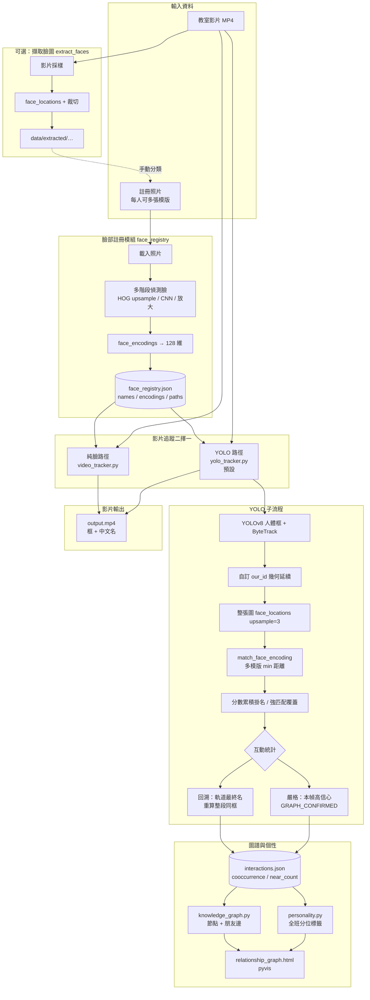
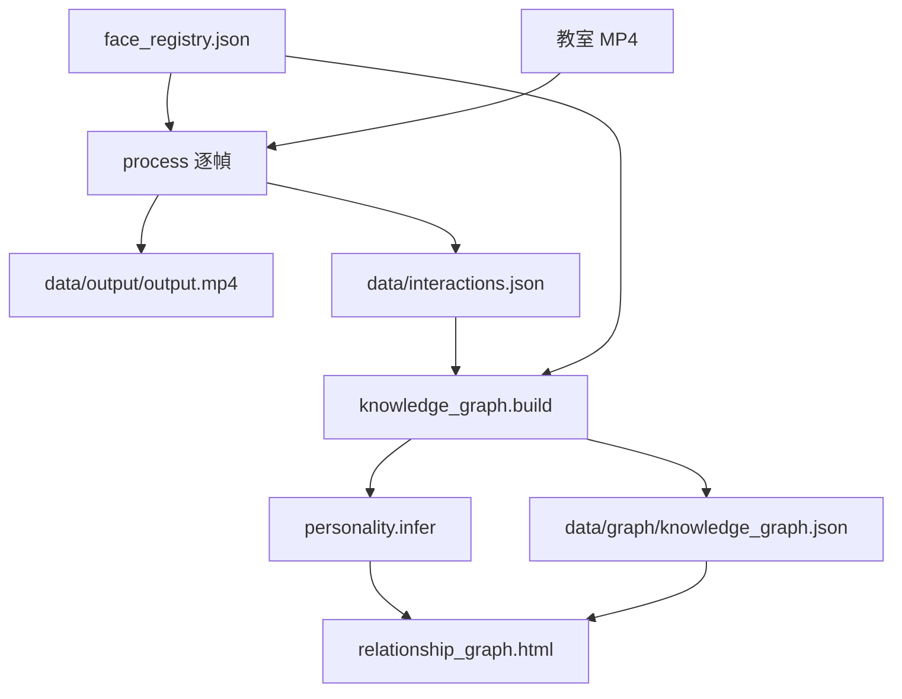
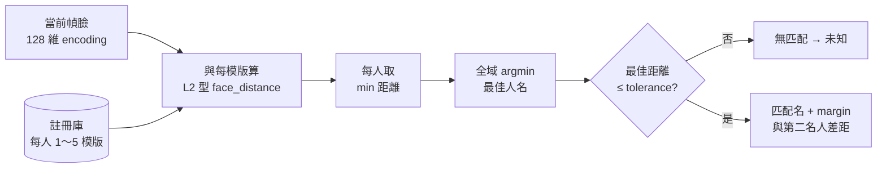

# 幼兒追蹤與知識圖譜 — 方法架構說明

> 本文件依目前程式碼整理：**流程、是否訓練、比對門檻與主要設定**。  
> 圖表使用 [Mermaid](https://mermaid.js.org/)，在 VS Code（Mermaid 擴充）、GitHub、Typora 等可預覽。

---

## 1. 總覽：是否「訓練模型」？

| 項目 | 說明 |
|------|------|
| **本專案是否訓練深度模型** | **否**。未對教室影片或幼兒臉做 fine-tune。 |
| **人體偵測／追蹤** | **YOLOv8**（`ultralytics`）預訓練權重，類別僅 **person (0)**。 |
| **臉部特徵** | **`face_recognition`**（底層 **dlib** 的 ResNet 臉部編碼），**128 維向量**，預訓練。 |
| **臉與人體框配對** | 幾何規則（臉中心落在人體框內、IoU／Hungarian 指派），**非學習式**。 |
| **「註冊」** | 將新照片之 encoding **寫入** `face_registry.json`，屬 **樣本庫擴充**，**非**反向傳播訓練。 |

---

## 2. 系統總流程（方法架構圖）

### 2.1 系統資料流 — 詳細逐步說明

以下依**實際程式呼叫順序**與**資料進出**，對照 `main.py` 與各模組。

#### 階段 A：準備資料（註冊）

| 步驟 | 誰執行 | 做什麼 | 讀／寫 |
|------|--------|--------|--------|
| A1 | `main.py register` 或 `register_all.py` | 使用者指定照片路徑與姓名 | 讀：`data/registered/…` 或任意路徑照片 |
| A2 | `face_registry.register_face` | 多階段找臉（HOG upsample → 可選 CNN／放大）→ `face_encodings` | 寫／更新：`data/face_registry.json`（`names`、`encodings`、路徑等） |
| A3 | （可選）`main.py extract-faces` | 從影片採樣幀裁臉、去重 | 讀：MP4；寫：`data/extracted/…` + manifest；**人工分類後**再回到 A1 註冊 |

**要點**：沒有註冊庫時，`process` 會直接結束；圖譜階段也會缺少節點來源。

---

#### 階段 B：處理影片 `main.py process`（核心資料流）

1. **入口**：`cmd_process` 呼叫 `get_registry_encodings()`，必須已有至少一人；`primary_name` 預設為註冊清單第一人（影響純臉路徑的「主要追蹤」顯示邏輯）。
2. **分支**（由 `USE_YOLO_TRACKER` 與 `--yolo` / `--no-yolo` 決定）：
   - **`yolo_tracker.process_video`**（預設）：人體 + 臉 + 軌道互動。
   - **`video_tracker.process_video`**（`--no-yolo`）：僅臉框 + OpenCV 追蹤，**無** `our_id` 人體軌道，互動統計語意不同（見 §4）。
3. **共通**：開啟 MP4 → 建 `VideoWriter` → **逐幀**迴圈；可選 `--start` / `--seconds` 限制區段。
4. **YOLO 路徑（逐幀內部順序，概念上）**：
   - 讀取當前幀 → **YOLO** 偵測 `person` → **ByteTrack**（或設定檔指定之追蹤器）→ 過濾過小人框（`YOLO_MIN_PERSON_AREA_FRAC`）。
   - **不依賴 YOLO 的 track id 當最終人軌**：以**當前幀人框與上一幀人框**做 IoU／面積比／中心距離等幾何配對，得到穩定的 **`our_id`**（見 `config` 中 `TRACK_IOU_*` 等）。
   - **臉**：在**整張圖**上做 `face_locations`（upsample）→ 每個臉 encoding → 與註冊庫比對（多模版取每人最小距離再比誰最近）；辨識幀間隔由 `DETECT_EVERY_N_FRAMES` 控制，其餘幀可用 OpenCV 追蹤器補位置（`TRACK_USE_OPENCV_TRACKER`）。
   - **臉與人框配對**：幾何上把臉歸到某個人體框（例如臉中心落在框內、再搭配指派算法），使「這張臉」掛在「這個 our_id」上。
   - **掛名狀態機**：累積分數（belief）、首次掛名門檻（距離 + margin + 連續命中）、`NEVER_SWITCH_NAME` / **強匹配覆蓋**（距離夠近 + 連續命中 + 冷卻）等 → 得到該軌道當幀顯示名（可能為「未知」）。
   - **畫面輸出**：在人框／臉旁繪製中文標籤 → 寫入 **`data/output/output.mp4`**（或 `--output` 路徑）。
5. **互動累積（與畫面並行）**：
   - 同一幀內，若兩不同姓名同時出現 → **同框**計次（無向，姓名排序成鍵）；若兩人體框中心距離 &lt; `NEAR_DISTANCE_PX` → **靠近**計次。
   - **同一對**在 `SAME_FRAME_COOLDOWN` 秒內不重複加計，避免單段時間爆炸計數。
   - **回溯模式**（`TRACK_FINAL_NAME_RETROSPECTIVE_INTERACTIONS=True`）：每條 `our_id` 軌道在記憶體中保留「每幀顯示名」；影片跑完後用規則決定**該軌整段的最終歸屬名**（最後一幀有名用其名；最後未知則用**未知前最後一次註冊名**；從未掛名則不計），再**重算**整支影片的同框／靠近並寫檔。**關閉時**：僅「本幀已掛名且臉距 ≤ `GRAPH_CONFIRMED_MAX_DISTANCE`」才計入（舊行為，較嚴）。
   - **寫檔**：`data/interactions.json`（`cooccurrence`、`near_count`、模式標記等）。

---

#### 階段 C：建圖 `main.py build-graph`

| 步驟 | 模組 | 做什麼 | 讀／寫 |
|------|------|--------|--------|
| C1 | `relationship_graph.run_build_and_draw` |  orchestrate 建圖 + 畫圖 | — |
| C2 | `knowledge_graph.build_knowledge_graph` | 讀 `interactions.json`；呼叫 `personality.infer_personality`；用 **NetworkX** 建圖：節點 = 註冊名 ∪ 互動中出現名；邊 = 同框 ≥ `MIN_COOCCURRENCE_FOR_FRIEND`，權重含同框+靠近 | 讀：`INTERACTIONS_FILE`；寫：`data/graph/knowledge_graph.json` |
| C3 | `relationship_graph.draw_relationship_graph` | **pyvis** 產生可拖曳 HTML，節點顏色依個性標籤 | 寫：`data/graph/relationship_graph.html`（路徑可依參數） |

**要點**：個性標籤為**全班相對分位**之代理指標（見 §9），非問卷量表。

---

#### 階段 D：一鍵 `run-all`

依序：**register（一張）** → **process** → **build-graph**，適合示範；量產註冊仍建議分開執行以便除錯。

---

#### 資料流總表（檔案視角）

| 檔案／目錄 | 產生者 | 消費者 |
|------------|--------|--------|
| `data/face_registry.json` | `face_registry` | `process`（比對）、`knowledge_graph`（節點補齊） |
| `data/output/*.mp4` | `yolo_tracker` / `video_tracker` | 人檢視 |
| `data/interactions.json` | `process`（`collect_interactions=True`） | `build_knowledge_graph`、`personality` |
| `data/graph/knowledge_graph.json` | `knowledge_graph` | 可給其他分析；`relationship_graph` 內部亦用 |
| `data/graph/relationship_graph.html` | `relationship_graph` | 瀏覽器開啟 |
| `data/extracted/*`（可選） | `extract_faces` | 人工 → `register` |

---

### 2.2 循序資料流圖（簡化版）

---

## 3. 臉部「比對」邏輯（多模版）

- **距離**：`face_recognition.face_distance`（與臉部編碼相容之距離度量）。  
- **tolerance（YOLO 辨識幀）**：`min(0.72, FACE_MATCH_TOLERANCE + 0.12)`（見 `yolo_tracker.py`）。  
- **純臉追蹤**：使用 `FACE_MATCH_TOLERANCE`（無 +0.12）。

---

## 4. YOLO 與純臉路徑對照

| 維度 | YOLO 路徑 (`USE_YOLO_TRACKER=True`) | 純臉路徑 (`--no-yolo`) |
|------|--------------------------------------|-------------------------|
| 偵測對象 | 人體框 → 再配臉 | 直接臉框 |
| 軌道 ID | 自訂 `our_id`（IoU／幾何） | 以「名字」為鍵平滑 |
| 互動回溯 | 支援 `TRACK_FINAL_NAME_RETROSPECTIVE_INTERACTIONS` | 不適用（無 oid 軌道） |
| 圖譜高信心過濾 | 嚴格模式：本幀需 `≤ GRAPH_CONFIRMED_MAX_DISTANCE` | 無此欄；凡非「未知」即可能計入 |

---

## 5. 主要門檻／比對數值一覽（依 `config.py` 預設）

> `TRACKING_MODE = "balanced"` 時；若改 `stable_names` / `more_coverage`，下列「追蹤組」數值會變。

| 符號／概念 | 變數或位置 | 預設值 | 意義 |
|------------|------------|--------|------|
| 臉匹配鬆緊 | `FACE_MATCH_TOLERANCE` | **0.68** | 越小越嚴；純臉流程用 |
| YOLO 幀匹配上限 | `min(0.72, FACE_MATCH_TOLERANCE+0.12)` | **0.72** | 與 0.68+0.12 取 min，故常為 0.72 |
| 每人最多模版 | `MAX_TEMPLATES_PER_PERSON` | **5** | 超過刪最舊 |
| 圖譜單幀高信心 | `GRAPH_CONFIRMED_MAX_DISTANCE` | **0.50** | 嚴格互動時計入圖譜門檻 |
| 畫「朋友」邊 | `MIN_COOCCURRENCE_FOR_FRIEND` | **3** | 同框計次 ≥ 此值 |
| 兩人算「靠近」 | `NEAR_DISTANCE_PX` | **150** px | 兩人框中心距離 |
| 同框冷卻 | `SAME_FRAME_COOLDOWN` | **0.5** s | 同一對不重複加計間隔 |
| 強匹配換軌名 | `STRONG_MATCH_OVERRIDE_DISTANCE` | **0.40** | 距離夠小才允許覆蓋 |
| 掛名分數門檻 | `NAME_MIN_SCORE_TO_SHOW` | **0.6** | 累積證據達標才顯示真名 |
| 第一名領先第二名 | `NAME_SWITCH_TOP2_DELTA` | **0.25** | 減少相似臉誤掛 |
| 追蹤模式 balanced | `FIRST_ASSIGN_MAX_DISTANCE` 等 | 0.57 / margin 0.055… | 見下節 |

---

## 6. `TRACKING_MODE` 三組預設（節錄）

| 模式 | `FIRST_ASSIGN_MAX_DISTANCE` | `MIN_MARGIN_BEFORE_ASSIGN` | `TRACK_PERSISTENCE_FRAMES` | 取向 |
|------|----------------------------|----------------------------|----------------------------|------|
| `stable_names` | 0.55 | 0.06 | 70 | 名字最穩、未知可能較多 |
| `balanced` | **0.57** | **0.055** | **78** | **預設折衷** |
| `more_coverage` | 0.58 | 0.05 | 85 | 較多綠框、較易偶發跳名 |

---

## 7. YOLO 推論設定（非訓練超參）

| 變數 | 預設 | 說明 |
|------|------|------|
| `YOLO_PERSON_MODEL_SIZE` | **s** | yolov8s.pt |
| `YOLO_IMGSZ` | **960** | 輸入縮放邊長 |
| `YOLO_CONF` | **0.28** | 人體信心閾值 |
| `YOLO_IOU` | **0.50** | NMS |
| `YOLO_MAX_DET` | **50** | 單幀最多偵測人數 |
| `YOLO_TRACKER` | **bytetrack.yaml** | 追蹤器設定檔 |
| `YOLO_MIN_PERSON_AREA_FRAC` | **0.0008** | 過小人體框丟棄 |

---

## 8. 互動統計兩種模式

| `TRACK_FINAL_NAME_RETROSPECTIVE_INTERACTIONS` | 行為 |
|-----------------------------------------------|------|
| **True**（預設） | 每條軌道：**最後一幀已掛名**則用之；**最後仍未知**則用**未知前最後一次出現的註冊名**；從未掛名則不計。該軌道有框之幀皆歸此名後重算同框／靠近。`interaction_counting: retrospective_final_name_per_track`。 |
| **False** | 僅本幀已掛名且臉距 **≤ GRAPH_CONFIRMED_MAX_DISTANCE** 者計入（舊行為）。`per_frame_confirmed_face_only`。 |

---

## 9. 個性標籤（`personality.py`）

| 變數 | 預設 | 意義 |
|------|------|------|
| `PERSONALITY_EXTREME_GROUP_FRAC` | **0.15** | 整合度最低／最高約各 15% → 內向型／活躍型 proxy |
| `PERSONALITY_MIN_PEOPLE` | **4** | 低於此人數改簡化規則 |
| `PERSONALITY_NEAR_CO_RATIO_PCT` | **70** | 靠近／同框比 ≥ 此百分位 → 易標親密型 |
| `PERSONALITY_SOCIAL_PARTNER_PCT` | **70** | 互動對象數高 → 易標社交型 |

---

## 10. 關係圖視覺（`relationship_graph.py`）

| 變數 | 預設 |
|------|------|
| `RELATIONSHIP_GRAPH_HEIGHT` | 780px |
| `RELATIONSHIP_GRAPH_NODE_SIZE` | 30 |
| `GRAPH_PHYSICS_SPRING_LENGTH` | 280 |
| `GRAPH_PHYSICS_REPULSION` | -120 |
| `GRAPH_PHYSICS_CENTRAL_GRAVITY` | 0.004 |
| `GRAPH_PHYSICS_STABILIZATION_ITERS` | 320 |

---

## 11. 影片擷取臉圖（`extract_faces.py` 預設）

| 參數 | 預設 | 說明 |
|------|------|------|
| `--every-n` | 20 | 每隔幾幀採樣 |
| `--max-crops` | 400 | 最多存幾張臉 |
| `--min-face` | 0.0012 | 臉框占畫面比例下限 |
| `--dedup` | 0.22 | encoding 距離低於此視為重複角度 |
| `--model` | hog | 可改 `cnn` 較準較慢 |

---

## 12. 指令與產物對照

| 指令 | 產物／效果 |
|------|------------|
| `main.py register` | 更新 `data/face_registry.json` |
| `main.py extract-faces` | `data/extracted/…` 臉圖 + manifest |
| `main.py process` | `data/output/*.mp4`、`data/interactions.json` |
| `main.py build-graph` | `data/graph/knowledge_graph.json`、`relationship_graph.html` 等 |
| `main.py run-all` | 註冊一張 + process + 建圖 |

---

## 13. 已內建 PNG 架構圖（專案內）

- **主圖**：`docs/methodology_architecture.png`  
  - 風格：**步驟 1～8** 垂直流程、分色方塊、條列說明（對齊簡報／論文用方法圖）；頁首說明無訓練／註冊／比對；右側 **輔助工具 extract-faces**；底部 **關鍵參數**（數值由 `config.py` 動態帶入）。  
- **參數附表**：`docs/methodology_config_table.png`（完整 `config` 條列表，同腳本一併產出）  
- **重繪**：`python docs/render_methodology_figure.py`（需 `matplotlib`；主圖／參數表字級與畫布以腳本為準；數值皆 `import config`）  
- **依據**：腳本檔首註解已標明對應之原始碼檔案；圖中為專案行為之**摘要敘述**（非另建演算法）；配色與版式僅為閱讀用。

## 14. 其他匯出方式（Mermaid 細圖）

1. 將本檔上傳至 [Mermaid Live Editor](https://mermaid.live/) 匯出 SVG/PNG。  
2. 或在 VS Code 安裝 **Mermaid** 相關擴充，預覽後截圖。

---

*文件版本：依專案 `config.py` 與主流程整理；實際數值以你本機 `config.py` 為準。*
